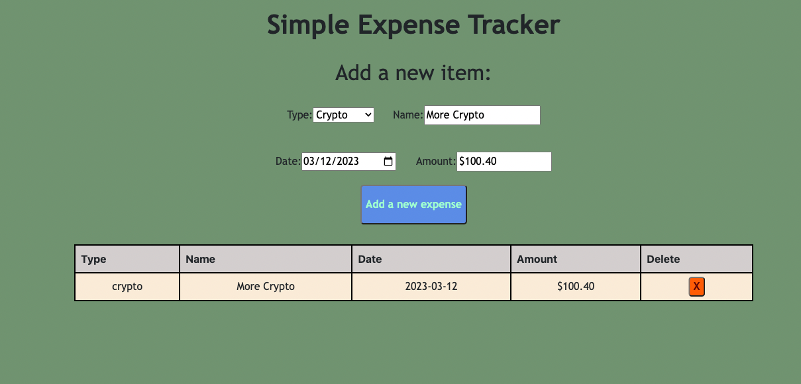

# Expense Tracker App

_Basic Expense track writting in HTML, CSS, and React_

Try it [here](https://charming-maamoul-f6ec6e.netlify.app/)

## Summary

This was this first time diving into React and Node. It was super fun and very challenging to learn more about React as a declaritive language and the extensive functionality of creating modular code within componenets. 

This took me a few weeks of conistent study and experimentation, but I've gained a lot more understanding with JSX and utilizing a library that allows for more compressed as well as complex UI's that are great for developer teams and the over all user experience.

## Author

- Gary Hughes Jr - _Full-Stack Software Developer_ - [Website](https://garyleehughesjr.com/) | [LinkedIn](https://www.linkedin.com/in/gary-hughes-jr-64925b229/)